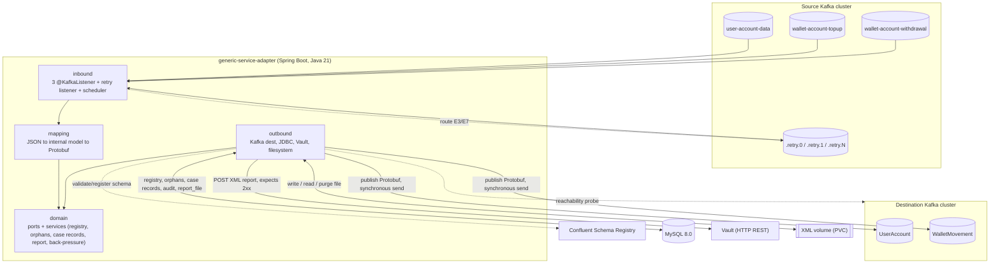

# Components

Internal decomposition of the single application. Design level:
**components, boundaries, contracts** — not method signatures or function bodies.
References: ADR [0001](adr/0001-strati-e-confini-componenti.md) (layers + ports),
ADR [0003](adr/0003-grace-period-orfani-scheduler.md) (`OrphanHoldService` hold + `OrphanReprocessor` pass),
ADR [0007](adr/0007-back-pressure-e6.md) (`BackPressureController`),
ADR [0016](adr/0016-report-runner-in-process.md) (report runner).

## Layering + per-flow sub-packages

The app uses the five layers expected by `adapter-dev` — `inbound/ outbound/
domain/ mapping/ config/` — with **light hexagonal boundaries**: the **ports**
are interfaces declared in `domain`, the implementations live in `outbound` (and
in `inbound` for the inbound adapters). `domain` does not depend on Spring Kafka,
Spring Data JDBC, the Protobuf serializer or the HTTP client.

```
it.generic_service_adapter
├── config/                         Spring configuration, no domain logic
│   ├── kafka/                       multi-cluster factory (source/destination), @RetryableTopic, MANUAL_IMMEDIATE ack
│   ├── persistence/                 DataSource, Flyway, Spring Data JDBC
│   ├── web/                         RestClient towards the Vault
│   ├── observability/               Actuator, Micrometer, "downstream" health group
│   └── properties/                  @ConfigurationProperties per environment (no hardcoded value)
│
├── inbound/                        inbound adapters (event-driven or time-driven)
│   ├── anagrafica/                  @KafkaListener on user-account-data
│   ├── movimenti/                   @KafkaListener on wallet-account-topup and -withdrawal
│   ├── retry/                       @RetryableTopic listener of the .retry.<n> topics (E3/E7)
│   ├── schedule/                    ReportRunner (@Scheduled) + OrphanReprocessor (@Scheduled) + OrphanReprocessorCommit (tx boundary)
│   └── common/                      JSON deserialization, structural validation, business-key extraction, E1..E7 classification
│
├── mapping/                        JSON → internal model → Protobuf translation
│   ├── anagrafica/                  UserAccount: accounts[], full_name, enum→default, ISO-8601→Timestamp
│   ├── movimenti/                   WalletMovement: Money{minor_units,currency}, direction, value_date
│   └── common/                      enum mapper with explicit default + warning metric, ISO-8601 / ISO-4217 parser, technical fields
│
├── domain/                        internal model + PORTS + domain services (no infrastructure dependencies)
│   ├── model/                       UserAccountRecord, WalletMovementRecord, Money, ErrorCategory, ProcessingContext
│   ├── anagrafica/                  AnagraphicRegistry (port): CAS on version, additive merge of accounts
│   ├── orfani/                      OrphanHoldService (service), OrphanStore (port)
│   ├── casistica/                   CaseStore (port), PENDING_REPORT→IN_REPORT→REPORTED transitions
│   ├── report/                      ReportAssembler (service), ReportFileStore (port), ReportSink (port)
│   ├── publish/                     UserAccountPublisher (port), MovementPublisher (port), AuditStore (port)
│   └── backpressure/               BackPressureController (service), ListenerControl (port), DestinationProbe (port)
│
└── outbound/                      port implementations
    ├── kafka/                       KafkaUserAccountPublisher, KafkaMovementPublisher (destination cluster, protobuf, synchronous send)
    ├── persistence/                JDBC adapters for AnagraphicRegistry, OrphanStore, CaseStore, ReportFileStore, AuditStore
    ├── vault/                       VaultReportSink (RestClient, POST, outcome only on 2xx, RetryTemplate)
    ├── filestore/                   FilesystemReportFileStore (write/read/purge of XML files on the volume)
    └── listener/                    KafkaListenerControl (pause/resume via KafkaListenerEndpointRegistry), KafkaDestinationProbe
```

**Dependency rule.** `inbound → mapping → domain`; `outbound → domain`; `config`
wires the layers together. No arrow from `domain` towards
`inbound/outbound/mapping/config`. The internal model in `domain/model` is the
only type that crosses the boundaries.

## C4-like view — Container



**Caption.** A single application container. It consumes from the 3 source topics
and from the retry topics of the same cluster; it publishes to the 2 topics of
the destination cluster with a synchronous `send()` before the source-offset
ack. MySQL 8.0 is the single store for the anagraphic registry, orphan movements
on hold, case records, report files and audit. The Schema Registry is queried by
the outbound Protobuf serializer. The Vault receives the reports via `POST`. The
persistent volume hosts the XML file spool. The probe towards the destination
cluster feeds back-pressure (E6).

## C4-like view — Component (inside the app)

```mermaid
flowchart TB
    subgraph INB["inbound"]
      LA["anagrafica<br/>@KafkaListener"]
      LM["movimenti<br/>@KafkaListener (topup + withdrawal)"]
      LR["retry<br/>@RetryableTopic listener"]
      SR1["schedule/ReportRunner<br/>@Scheduled + GET_LOCK MySQL per tick"]
      SR2["schedule/OrphanReprocessor (+ OrphanReprocessorCommit)<br/>@Scheduled every ~15s"]
      CMN["common<br/>JSON deser + validation + E1..E7 classification"]
    end

    subgraph MP["mapping"]
      MA["anagrafica mapper"]
      MM["movimenti mapper"]
    end

    subgraph DM["domain (ports + services)"]
      REG["AnagraphicRegistry (port)"]
      OHS["OrphanHoldService (service)"]
      OST["OrphanStore (port)"]
      CST["CaseStore (port)"]
      RASM["ReportAssembler (service)"]
      RFS["ReportFileStore (port)"]
      RSK["ReportSink (port)"]
      UAP["UserAccountPublisher (port)"]
      MVP["MovementPublisher (port)"]
      AUD["AuditStore (port)"]
      BPC["BackPressureController (service)"]
      LC["ListenerControl (port)"]
      DP["DestinationProbe (port)"]
    end

    subgraph OUB["outbound (adapters)"]
      KUA["KafkaUserAccountPublisher"]
      KMV["KafkaMovementPublisher"]
      PJDBC["persistence/*  (Spring Data JDBC)"]
      VLT["VaultReportSink (RestClient)"]
      FFS["FilesystemReportFileStore"]
      KLC["KafkaListenerControl"]
      KDP["KafkaDestinationProbe"]
    end

    LA --> CMN --> MA --> REG
    LM --> CMN --> MM --> REG
    MM --> OHS
    LR --> CMN
    OHS --> OST
    SR2 --> OST
    SR2 --> REG
    SR2 --> MVP
    SR2 --> AUD
    SR2 --> CST
    SR2 --> BPC
    MA --> UAP
    MM --> MVP
    UAP --> AUD
    MVP --> AUD
    CMN --> CST
    SR1 --> RASM --> CST
    RASM --> RFS
    RASM --> RSK
    BPC --> LC
    BPC --> DP
    KUA -. implements .-> UAP
    KMV -. implements .-> MVP
    PJDBC -. implements .-> REG
    PJDBC -. implements .-> OST
    PJDBC -. implements .-> CST
    PJDBC -. implements .-> RFS
    PJDBC -. implements .-> AUD
    VLT -. implements .-> RSK
    FFS -. implements .-> RFS
    KLC -. implements .-> LC
    KDP -. implements .-> DP
```



**Caption.** Solid arrows are runtime calls; the dashed "implements" arrows bind
an `outbound` adapter to the `domain` port it realizes. `ReportFileStore` is
implemented by two adapters with disjoint responsibilities:
`FilesystemReportFileStore` for the file content on the volume, `persistence/*`
for the `report_file` metadata in MySQL 8.0. All other ports have a single
adapter.

## Responsibilities and ownership

| Component | Layer / package | Responsibility | Owns |
|---|---|---|---|
| Anagrafica listener | `inbound/anagrafica` | Consumes `user-account-data`, `MANUAL_IMMEDIATE` ack only after the outcome (RF-11). | `user-account-data` offset |
| Movimenti listener | `inbound/movimenti` | Consumes `wallet-account-topup` and `-withdrawal`, a single path, `direction` derived from the topic. | offsets of the two movement topics |
| Retry listener | `inbound/retry` | Consumes the `.retry.<n>` topics (E3/E7), retries mapping+publish, on retry exhaustion requests the case record. | retry-topic offsets |
| `ReportRunner` | `inbound/schedule` | 15-min tick + polling of the `PENDING_REPORT` count every ~30s; **single-instance** via MySQL application lock (`GET_LOCK('gsa_report_runner', 0)` acquired at the start of the tick, `RELEASE_LOCK` at the end of the tick); orchestrates generation + send (ADR 0016). | per-tick lock `gsa_report_runner`; `report_file` lifecycle |
| `OrphanReprocessor` (+ `OrphanReprocessorCommit` tx boundary) | `inbound/schedule` | Scheduled pass every ~15s: per `HELD` `orphan_movement` row, re-checks `AnagraphicRegistry` and either **resolves** (re-parse → `AuditStore` dedup check → `MovementPublisher` publish → `audit` INSERT + `state=RESOLVED` in one post-publish tx) / **expires to E4** (`CaseStore` `case_record` + `state=EXPIRED` in one tx) / **freezes the hold** while `BackPressureController.isBackPressureActive()`. Drives `OrphanStore`, `AnagraphicRegistry`, `MovementPublisher`, `AuditStore`, `CaseStore` directly. | resolve / expire / freeze of held orphans |
| `inbound/common` | `inbound/common` | JSON parsing, structural validation, `businessKeys` extraction, `E1..E7` classification, `ProcessingContext` construction (`topic/partition/offset`, `processing_id`). | inbound error taxonomy |
| Anagrafica / movimenti mapper | `mapping/*` | Validated JSON → internal model → Protobuf message; enum→default with warning metric (RF-08); technical fields `ingestion_time` / `source` / `processing_id`. | transformation rules from §4 of the analysis |
| `AnagraphicRegistry` | port in `domain/anagrafica`, impl in `outbound/persistence` | Existence read for `userId` / `accountId`; registry write with **CAS** `WHERE last_version < :incoming` (RF-31); additive merge of accounts (ADR 0014). | `anag_user`, `anag_account` |
| `OrphanHoldService` | service in `domain/orfani` | **Hold half only**: on the RF-25 registry miss, parks the movement — one `INSERT` into `orphan_movement` (`state=HELD`, `hold_deadline = received_at + holdTimeout`, original payload + source metadata). No re-check, no publish, no `E4` — that is `OrphanReprocessor` (ADR 0003). | `HELD` state of the orphan movement |
| `CaseStore` | port in `domain/casistica`, impl in `outbound/persistence` | Creates `case_record`; guarded transitions `WHERE case_state = :expected` (ADR, no library). | `case_record`, case-record state machine |
| `ReportAssembler` | service in `domain/report` | Selects `PENDING_REPORT`, moves them to `IN_REPORT`, builds the XML (header with counts, `rawPayload` as text with full XML escaping, `maxBytes`), creates the `report_file` record. | report shape, `report_file.id` (UUID) |
| `ReportFileStore` | port in `domain/report` | Persistence of `report_file` metadata (JDBC) + file content (filesystem) + purge by age (7 days). | `report_file`, spool on the volume |
| `ReportSink` | port in `domain/report`, impl in `outbound/vault` | `POST` of the file to the Vault, outcome only on `2xx`, `RetryTemplate` for the single attempt; on success marks `report_file = SENT` and the case records `REPORTED`. | HTTP channel towards the Vault |
| `UserAccountPublisher` / `MovementPublisher` | ports in `domain/publish`, impl in `outbound/kafka` | **Synchronous** `send()` to `UserAccount` / `WalletMovement`, `enable.idempotence=true`, `acks=all`; preserves the business key (RF-10). | producer towards the destination cluster |
| `AuditStore` | port in `domain/publish`, impl in `outbound/persistence` | One `INSERT` into `audit` per published message, **before** the ack (RF-29). Skip republish of already-present movements (`UNIQUE (txn_dedup, published_date)` constraint on the generated columns `txn_dedup` + `published_date` = `DATE(published_at)`). | `audit` |
| `BackPressureController` | service in `domain/backpressure` | On `E6` pauses **all** listeners (main + retry) via `ListenerControl`, starts `DestinationProbe`, resumes on recovery, emits the `DEST_CLUSTER_DOWN` alert (ADR 0007). | global back-pressure state |
| `config/*` | `config` | Multi-cluster Kafka factory, `@RetryableTopic` (custom `RetryTopicConfiguration`), DataSource + Flyway, `RestClient`, Actuator + `downstream` health group, `@ConfigurationProperties`. | technology binding, no domain logic |

## Section boundaries

This page fixes *which* components exist, *who owns what* and *how they talk*. It
does not define class or method signatures, does not choose libraries beyond
those already decided (see [`dipendenze.md`](dipendenze.md) and ADRs 0010-0012,
0016-0017). The package structure is indicative and binding only at the layer
level and in the dependency rule; the fine cut of the sub-packages is up to
`adapter-dev`.
