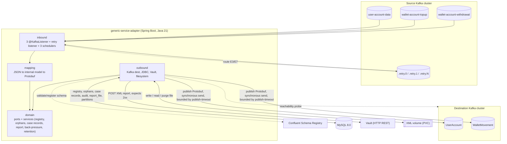

# Components

Internal decomposition of the single application. Design level:
**components, boundaries, contracts** — not method signatures or function bodies.
References: ADR [0001](adr/0001-strati-e-confini-componenti.md) (layers + ports),
ADR [0002](adr/0002-retry-retryabletopic-e4-deadline.md) (manual retry routing),
ADR [0003](adr/0003-grace-period-orfani-scheduler.md) (`OrphanHoldService` hold + `OrphanReprocessor` pass),
ADR [0007](adr/0007-back-pressure-e6.md) (`BackPressureController`),
ADR [0016](adr/0016-report-runner-in-process.md) (report runner),
ADR [0017](adr/0017-osservabilita-actuator-micrometer.md) / [0018](adr/0018-liveness-readiness-shutdown.md) (observability, health, shutdown).

> Updated post-M9 (2026-09-11) to match the code actually written in WP0-WP9
> (`src/main/java/it/generic_service_adapter/**`), not the WP0-era plan. This is
> the biggest diff of this pass — see the handoff note at the bottom.

## Layering + per-flow sub-packages

The app uses the five layers expected by `adapter-dev` — `inbound/ outbound/
domain/ mapping/ config/` — with **light hexagonal boundaries**: the **ports**
are interfaces declared in `domain`, the implementations live in `outbound` (and
in `inbound` for the inbound adapters). `domain` does not depend on Spring Kafka,
Spring Data JDBC, the Protobuf serializer or the HTTP client — with one
documented, deliberate exception (`config/backpressure/BackPressureProbeScheduler`,
see the note under "Domain purity" below).

```
it.generic_service_adapter
├── config/                         Spring configuration, no domain logic
│   ├── kafka/                       DestinationKafkaProducerConfig (destination-cluster Protobuf producer + Schema Registry), SourceKafkaConsumerConfig (source-cluster consumer factory), RetryKafkaConfig (source-cluster byte[] producer for retry routing + gsa-retry listener container factory), ListenerErrorHandlingConfig (never-recover CommonErrorHandler shared by the source and retry factories)
│   ├── persistence/                 package-info only: DataSource / Flyway / Spring Data JDBC are fully auto-configured from application*.yml, no custom @Configuration class needed
│   ├── web/                         VaultRestClientConfig (RestClient towards the Vault, JdkClientHttpRequestFactory with per-environment connect/read timeout)
│   ├── observability/               Micrometer meter binders (see "Observability" below) + health-group wiring
│   │   └── health/                   custom Actuator HealthIndicators for ids Spring Boot 4.1 does not ship natively: readiness group (`flyway`, `kafka` = source cluster only), `downstream` group (`destinationKafka`, `schemaRegistry`, `vault`)
│   ├── properties/                  @ConfigurationProperties records, one per external dependency / policy area (14 records: Kafka source/destination, Schema Registry, Vault, DataSource, retry, back-pressure, orphan-hold, report, mapping, alert thresholds, health-probe timeouts, observability polling, partition maintenance) — no hardcoded value (RF-15, RNF-09)
│   ├── backpressure/                BackPressureConfig (wires BackPressureController + its ports), BackPressureProbeScheduler (ProbeScheduler impl, single-thread scheduled executor)
│   ├── orfani/                      OrphanHoldConfig (wires OrphanHoldService)
│   ├── report/                      ReportConfig (wires the plain-class ReportAssembler)
│   ├── schedule/                    SchedulingConfig (@EnableScheduling, gsa.task.scheduling pool sizing)
│   └── time/                        ClockConfig (systemUtcClock bean — every `now()` in the app goes through this seam)
│
├── inbound/                        inbound adapters (event-driven or time-driven)
│   ├── anagrafica/                  AnagraphicEventListener (@KafkaListener), RegistryEventProcessor (orchestrator, owns the publish→commit sequence), RegistryCommit (tx boundary: CAS + accounts merge + audit)
│   ├── movimenti/                   MovementEventListener (@KafkaListener, topup + withdrawal), MovementEventProcessor (orchestrator: registry check, pre-publish dedup, publish, orphan hand-off), MovementCommit (tx boundary: audit)
│   ├── retry/                       RetryRouter (publishes to `*.retry.<n>` on the source cluster), RetryTopicListener (@KafkaListener group `gsa-retry`, non-blocking delay via `Acknowledgment.nack(Duration)`, re-attempt, exhaustion `case_record`), RetryPlan (retry-topic naming + per-category backoff, pure), RetryHeaders (header name/codec constants)
│   ├── schedule/                    ReportRunner + ReportRunnerCommit (Flow g — assembly, send queue, backlog alert, purge), OrphanReprocessor + OrphanReprocessorCommit (Flow c — resolve/expire/freeze pass), PartitionMaintenanceRunner (daily-partition maintenance for `audit` / `case_record`, WP8)
│   └── common/                      RegistryEventParser / MovementEventParser + their `*ParseResult` sum types (JSON deserialization + structural validation, E1/E2), BusinessKeys, ProcessingContextFactory, InboundCaseRecorder (writes `case_record` for E1/E2/E5/E7-or-E3-exhausted), DownstreamErrorClassifier (walks a publish-failure cause chain into E5/E6/E7)
│
├── mapping/                        JSON → internal model → Protobuf translation
│   ├── anagrafica/                  RegistryEventDto / AccountDto (JSON shape), UserAccountMapper
│   ├── movimenti/                   MovementEventDto, MovementMapper
│   └── common/                      Iso8601, Iso4217, TextNormalizer, UnknownEnumCounter (enum→default with warning metric, RF-08)
│
├── domain/                        internal model + PORTS + domain services (no infrastructure dependencies)
│   ├── model/                       UserAccountRecord, WalletMovementRecord, AccountRecord, Money, ErrorCategory, ProcessingContext, MovementDirection, *StatusValue / *TypeValue enums
│   ├── anagrafica/                  AnagraphicRegistry (port): CAS on `last_version`, additive merge of `accounts[]`; UserRegistryEntry, AccountEntry
│   ├── orfani/                      OrphanHoldService (service, **hold only**), OrphanStore (port); OrphanMovementRecord, OrphanState, OrphanHoldCommand
│   ├── casistica/                   CaseStore (port), CaseRecord, CaseState — `PENDING_REPORT → IN_REPORT → REPORTED`
│   ├── report/                      ReportAssembler (service), ReportFileStore (port — `report_file` metadata/queue), ReportFileContentStore (port — XML bytes on the spool, **separate** from `ReportFileStore`), ReportSink (port); AssembledReport, CaseKey, ReportFileNaming, ReportFileRecord, ReportFileState, SendOutcome
│   ├── publish/                     UserAccountPublisher (port), MovementPublisher (port), AuditStore (port); AuditRecord, AuditOutcome, MessageType, PublishResult, DestinationPublishException
│   ├── backpressure/                BackPressureController (service), ListenerControl (port), DestinationProbe (port), ProbeScheduler (port), BackPressureSignals (port); DownstreamKind
│   └── retention/                   PartitionMaintenance (port), PartitionMaintenancePlanner (pure planning), PartitionNaming (pure); MaintainedPartition, MaintainedTable
│
└── outbound/                      port implementations
    ├── kafka/                       KafkaUserAccountPublisher, KafkaMovementPublisher (destination cluster, Protobuf, synchronous `send().get(publishTimeout)`)
    ├── persistence/                 JDBC adapters (Spring Data JDBC / plain JDBC): JdbcAnagraphicRegistry, JdbcOrphanStore, JdbcCaseStore, JdbcReportFileStore, JdbcAuditStore, JdbcPartitionMaintenance (native DDL — `ALTER TABLE ... PARTITION`, not expressible in Spring Data JDBC)
    ├── vault/                       VaultReportSink (RestClient, POST, outcome only on 2xx, explicit retry loop)
    ├── filestore/                   FilesystemReportFileStore (write/read/delete of XML bytes, atomic `.tmp` + `ATOMIC_MOVE` spool)
    └── listener/                    KafkaListenerControl (pause/resume of every container — main and retry — via KafkaListenerEndpointRegistry), KafkaDestinationProbe (AdminClient.describeCluster with backoff)
```

**Dependency rule.** `inbound → mapping → domain`; `outbound → domain`; `config`
wires the layers together. No arrow from `domain` towards
`inbound/outbound/mapping/config`. The internal model in `domain/model` is the
only type that crosses the boundaries.

**Domain purity — one documented exception.** `domain/backpressure/ProbeScheduler`
is a port whose only implementation, `config/backpressure/BackPressureProbeScheduler`,
lives in `config` rather than `outbound`: it wraps a single-thread
`ScheduledExecutorService`, pure technical wiring with no external system to
reach, so the team judged an `outbound` adapter unwarranted for it. Every other
port keeps the `outbound` (or `inbound`, for commit-boundary beans) placement.

## Observability — cross-cutting, not a layer

`config/observability` is not drawn as a node in the Component diagram below
(it would touch almost every box) — it is described here and detailed in
[`nfr.md`](nfr.md) §Observability:

- **Metrics** (`Counter` / `Gauge` / `Timer`, all `gsa_*`): `InboundTrafficMetrics`
  (consumed count + backlog age, via a shared `RecordInterceptor` on both the
  source and retry listener factories), `DestinationPublishMetrics` (publish
  count + latency, wraps the two `outbound/kafka` publishers), `ConsumerLagMetrics`
  (re-exposes the `records-lag` client metric per topic-partition, **no**
  `AdminClient`), `DbLiveMetrics` (live `COUNT(*)` gauges: cases by state,
  registry size), `ReportBacklogMetrics` (live gauges off `ReportFileStore`),
  `BackPressureMetricsConfig` / `BackPressureSignalsAdapter` (the
  `gsa_back_pressure_active` gauge and the E6 down/recovered counters —
  `BackPressureSignals` port, implemented here so `domain/backpressure` stays
  Micrometer-free), `OrphanMetricsConfig` (`gsa_orphans_held` live gauge),
  `GsaMetricSeeds` (eagerly registers every lazily-created counter at 0 so its
  series exists on `/actuator/prometheus` before the first occurrence),
  `AlertEvaluator` (RF-23 — see below).
- **Health** — `config/observability/health`: see the package tree above and
  ADR 0018.
- **Alerting (RF-23)** — `AlertEvaluator`, a lightweight `@Scheduled` evaluator
  (`gsa.observability.alert-evaluation-interval`, default 30 s): compares
  `gsa_consumer_lag`, `gsa_backlog_age_seconds`, the `gsa_cases_total` rate and
  `gsa_orphans_expired_total` against `gsa.alert-thresholds.*` and keeps a
  `gsa_alert_active{signal}` gauge (0/1) plus a structured `WARN`/`INFO` log on
  each edge. It is **not** a rules engine. The Vault-backlog alert
  (`REPORT_QUEUE_BACKLOG`) and `gsa_back_pressure_active` are **not**
  re-evaluated here — they are already alerted by `ReportRunner` and by
  `BackPressureController` respectively (no double alert). `REPORT_QUEUE_BACKLOG`
  is a `WARN` log only, with no companion `gsa_alert_active{signal}` entry —
  a deliberate choice to avoid a second alert path for the same condition.

## C4-like view — Container



**Caption.** A single application container. It consumes from the 3 source topics
and from the retry topics of the same cluster; it publishes to the 2 topics of
the destination cluster with a synchronous, timeout-bounded `send()` before the
source-offset ack (ADR 0007 — explicit `max.block.ms` / `request.timeout.ms` /
`delivery.timeout.ms` on the producer plus a `future.get(publishTimeout)`
backstop in the publishers). MySQL 8.0 is the single store for the anagraphic
registry, orphan movements on hold, case records, report files, audit and the
daily-partition bookkeeping. The Schema Registry is queried by the outbound
Protobuf serializer. The Vault receives the reports via `POST`. The persistent
volume hosts the XML file spool. The probe towards the destination cluster feeds
back-pressure (E6).

## C4-like view — Component (inside the app)

```mermaid
flowchart TB
    subgraph INB["inbound"]
      LA["anagrafica<br/>@KafkaListener + RegistryCommit (tx)"]
      LM["movimenti<br/>@KafkaListener (topup+withdrawal) + MovementCommit (tx)"]
      LR["retry<br/>gsa-retry backoff listener"]
      SR1["schedule/ReportRunner<br/>@Scheduled + GET_LOCK MySQL per tick"]
      SR2["schedule/OrphanReprocessor (+ OrphanReprocessorCommit)<br/>@Scheduled every ~15s"]
      SR3["schedule/PartitionMaintenanceRunner<br/>@Scheduled every 6h + dedicated GET_LOCK"]
      CMN["common<br/>JSON deser + validation + E1/E2/E5/E7 classification"]
    end

    subgraph MP["mapping"]
      MA["anagrafica mapper"]
      MM["movimenti mapper"]
    end

    subgraph DM["domain (ports + services)"]
      REG["AnagraphicRegistry (port)"]
      OHS["OrphanHoldService (service)"]
      OST["OrphanStore (port)"]
      CST["CaseStore (port)"]
      RASM["ReportAssembler (service)"]
      RFS["ReportFileStore (port, metadata)"]
      RFC["ReportFileContentStore (port, bytes)"]
      RSK["ReportSink (port)"]
      UAP["UserAccountPublisher (port)"]
      MVP["MovementPublisher (port)"]
      AUD["AuditStore (port)"]
      BPC["BackPressureController (service)"]
      LC["ListenerControl (port)"]
      DP["DestinationProbe (port)"]
      PMT["PartitionMaintenance (port)"]
    end

    subgraph OUB["outbound (adapters)"]
      KUA["KafkaUserAccountPublisher"]
      KMV["KafkaMovementPublisher"]
      PJDBC["persistence/*  (JDBC)"]
      JPM["JdbcPartitionMaintenance"]
      VLT["VaultReportSink (RestClient)"]
      FFS["FilesystemReportFileStore"]
      KLC["KafkaListenerControl"]
      KDP["KafkaDestinationProbe"]
    end

    LA --> CMN --> MA --> REG
    LM --> CMN --> MM --> REG
    MM --> OHS
    LR --> CMN
    LR --> MA
    LR --> MM
    LR --> UAP
    LR --> MVP
    LR --> AUD
    LR -->|"reuses RegistryCommit"| LA
    LR -->|"reuses MovementCommit"| LM
    LR --> BPC
    OHS --> OST
    SR2 --> OST
    SR2 --> REG
    SR2 --> MVP
    SR2 --> AUD
    SR2 --> CST
    SR2 --> BPC
    SR3 --> PMT
    MA --> UAP
    MM --> MVP
    UAP --> AUD
    MVP --> AUD
    CMN --> CST
    SR1 --> RASM --> CST
    RASM --> RFS
    RASM --> RFC
    SR1 --> RFC
    SR1 --> RSK
    BPC --> LC
    BPC --> DP
    KUA -. implements .-> UAP
    KMV -. implements .-> MVP
    PJDBC -. implements .-> REG
    PJDBC -. implements .-> OST
    PJDBC -. implements .-> CST
    PJDBC -. implements .-> RFS
    PJDBC -. implements .-> AUD
    JPM -. implements .-> PMT
    VLT -. implements .-> RSK
    FFS -. implements .-> RFC
    KLC -. implements .-> LC
    KDP -. implements .-> DP
```



**Caption.** Solid arrows are runtime calls; the dashed "implements" arrows bind
an `outbound` adapter to the `domain` port it realizes. `report_file` storage is
**two** ports with disjoint responsibilities: `ReportFileStore` (metadata/queue
row in MySQL, `persistence/JdbcReportFileStore`) and `ReportFileContentStore`
(XML bytes on the volume, `filestore/FilesystemReportFileStore`) — kept separate
so neither adapter is forced to implement methods it cannot serve. `inbound/retry`
does not go through the `inbound/anagrafica` / `inbound/movimenti` `@KafkaListener`
orchestrators; it re-parses and re-maps a routed record itself and then, on a
confirmed publish, calls `RegistryCommit` or `MovementCommit` directly — the two
labelled edges above stand for that reuse, not for a call into the listener
methods. All other ports have a single adapter.

## Responsibilities and ownership

| Component | Layer / package | Responsibility | Owns |
|---|---|---|---|
| Anagrafica listener | `inbound/anagrafica` | Consumes `user-account-data`, `MANUAL_IMMEDIATE` ack only after the outcome (RF-11). | `user-account-data` offset |
| Movimenti listener | `inbound/movimenti` | Consumes `wallet-account-topup` and `-withdrawal`, a single path, `direction` derived from the topic. | offsets of the two movement topics |
| `RetryRouter` / `RetryTopicListener` | `inbound/retry` | `RetryRouter` publishes the untransformed record to `<sourceTopic>.retry.0` (main path) or `.retry.<n+1>` (still-failing re-attempt) on the **source** cluster. `RetryTopicListener` (consumer group `gsa-retry`) applies the `process-after` delay with `Acknowledgment.nack(Duration)` — this pauses the **whole `gsa-retry` consumer** for the remaining delay, not a single partition (a deliberate, documented deviation from the original "partition pause/resume" wording, see ADR 0002) — then re-parses, re-maps and re-publishes through the same ports as the live path. On a confirmed re-publish it calls `RegistryCommit` or `MovementCommit` **exactly like the live orchestrators** (CAS + accounts merge + audit, or pre-publish dedup + audit) before ack — a retry success is **not** just an ack, it is the same post-publish persistence as the live path (RF-29, ADR 0008). On exhaustion (`attempt + 1 == maxAttempts`) it writes the `case_record` itself (E7/E3, `attempts = maxAttempts`, `case_state = PENDING_REPORT`), no `.dlt` (ADR 0005). An E6 mid-attempt triggers `BackPressureController` and re-throws (no ack); an E5 mid-attempt writes a `case_record` and acks. | retry-topic offsets |
| `ReportRunner` | `inbound/schedule` | 15-min tick + polling of the `PENDING_REPORT` count every ~30s (RF-33 early trigger); **single-instance** via MySQL application lock (`GET_LOCK('gsa_report_runner', 0)` acquired at the start of the tick, `RELEASE_LOCK` at the end of the tick); orchestrates assembly + send-queue drain + backlog alert + purge (ADR 0016). The RF-33 threshold only counts `case_record.case_state = PENDING_REPORT`: once a batch has been claimed into `IN_REPORT`, the early trigger goes quiet again until the next batch accumulates or the 15-min schedule fires (see [`flussi.md`](flussi.md) §g). | per-tick lock `gsa_report_runner`; `report_file` lifecycle |
| `ReportRunnerCommit` | `inbound/schedule` | The DB-transaction boundary for `ReportRunner` (mirrors `OrphanReprocessorCommit`): `persistAssembly` claims the batch (`PENDING_REPORT → IN_REPORT`, sets `report_file_id`) and inserts the `report_file` row in one local tx, **after** the XML is already on the volume; `markSent` flips `report_file → SENT` and the case records `→ REPORTED` in one local tx, only after a Vault `2xx`. | `report_file` / `case_record` state transitions |
| `OrphanReprocessor` (+ `OrphanReprocessorCommit` tx boundary) | `inbound/schedule` | Scheduled pass every ~15s: per `HELD` `orphan_movement` row, re-checks `AnagraphicRegistry` and either **resolves** (re-parse → `AuditStore` dedup check → `MovementPublisher` publish → `audit` INSERT + `state=RESOLVED` in one post-publish tx) / **expires to E4** (`CaseStore` `case_record` + `state=EXPIRED` in one tx) / **freezes the hold** while `BackPressureController.isBackPressureActive()`. Drives `OrphanStore`, `AnagraphicRegistry`, `MovementPublisher`, `AuditStore`, `CaseStore` directly. | resolve / expire / freeze of held orphans |
| `PartitionMaintenanceRunner` | `inbound/schedule` | `@Scheduled` every `gsa.partition-maintenance.interval` (default 6h), guarded by its **own** `GET_LOCK` (`gsa_partition_maintenance` — deliberately distinct from the report-runner lock, so the two jobs never serialise on each other): pre-creates the daily partitions of `audit` and `case_record` up to `future-partitions-ahead-days` ahead, and drops the ones fully past retention. For `case_record` a **Batch-15 pre-check** (`SELECT COUNT(*) ... WHERE case_state <> 'REPORTED'`) skips a drop that would remove a non-`REPORTED` row (`CASE_RECORD_PARTITION_RETAINED` alert); `audit` drops unconditionally. See [`modello-dati.md`](modello-dati.md) §Partitioning and retention. | partition provisioning / drop for `audit`, `case_record` |
| `inbound/common` | `inbound/common` | JSON parsing, structural validation, `businessKeys` extraction, `E1/E2` classification, `ProcessingContext` construction (`topic/partition/offset`, `processing_id`); `InboundCaseRecorder` (writes `case_record` for E1/E2/E5/retry-exhausted); `DownstreamErrorClassifier` (walks the cause chain of a `DestinationPublishException` — or any `RuntimeException` that escaped an orchestrator — into E5/E6/E7; E6 includes Kafka's own `TimeoutException`/`RetriableException`/`NetworkException`/I-O causes **and** the publishers' `java.util.concurrent.TimeoutException` backstop). | inbound error taxonomy |
| Anagrafica / movimenti mapper | `mapping/*` | Validated JSON → internal model → Protobuf message; enum→default with warning metric (RF-08); technical fields `ingestion_time` / `source` / `processing_id`. | transformation rules from §4 of the analysis |
| `AnagraphicRegistry` | port in `domain/anagrafica`, impl in `outbound/persistence` | Existence read for `userId` / `accountId`; registry write with **CAS** `WHERE last_version < :incoming` (RF-31); additive merge of accounts (ADR 0014). | `anag_user`, `anag_account` |
| `OrphanHoldService` | service in `domain/orfani` | **Hold half only**: on the RF-25 registry miss, parks the movement — one `INSERT` into `orphan_movement` (`state=HELD`, `hold_deadline = received_at + holdTimeout`, original payload + source metadata). No re-check, no publish, no `E4` — that is `OrphanReprocessor` (ADR 0003). | `HELD` state of the orphan movement |
| `CaseStore` | port in `domain/casistica`, impl in `outbound/persistence` | Creates `case_record`; guarded transitions `WHERE case_state = :expected` (ADR, no library). | `case_record`, case-record state machine |
| `ReportAssembler` | service in `domain/report` | Selects `PENDING_REPORT`, builds the XML (header with counts, `rawPayload` as text with full XML escaping, truncated to `maxBytes` UTF-8 bytes **before** escaping), returns the assembled report + the batch of claimed case keys for `ReportRunnerCommit` to persist. `xs:dateTime` values are emitted at **second precision** (`uuuu-MM-dd'T'HH:mm:ss'Z'`), dropping the sub-second part of the `DATETIME(6)` columns — the XSD does not constrain precision, and the sample in `docs/report-xml/` is itself at second precision. Schema: [`docs/report-xml/case-report-v1.xsd`](../report-xml/case-report-v1.xsd). | report shape |
| `ReportFileStore` | port in `domain/report`, impl `outbound/persistence/JdbcReportFileStore` | Persistence of the `report_file` **metadata** row (JDBC): state, `next_attempt_at`, queue reads, purge-due reads. | `report_file` row |
| `ReportFileContentStore` | port in `domain/report`, impl `outbound/filestore/FilesystemReportFileStore` | Write / read / delete of the XML **bytes** on the volume, atomic spool (`.tmp` + `ATOMIC_MOVE`). | XML spool on the volume |
| `ReportSink` | port in `domain/report`, impl in `outbound/vault` | `POST` of the file to the Vault, outcome only on `2xx`; an **explicit retry loop** (`gsa.vault.max-attempts`, blocking `Thread.sleep` backoff between attempts — legal here because this runs on the `ReportRunner` `@Scheduled` thread, not a Kafka listener) for the single send; never throws — a terminal failure returns `RETRYABLE_FAILURE` for the durable `report_file` queue to retry on a later tick. | HTTP channel towards the Vault |
| `UserAccountPublisher` / `MovementPublisher` | ports in `domain/publish`, impl in `outbound/kafka` | **Synchronous** `send().get(publishTimeout)` to `UserAccount` / `WalletMovement`, `enable.idempotence=true`, `acks=all`; preserves the business key (RF-10). The producer carries explicit `max.block.ms` / `request.timeout.ms` / `delivery.timeout.ms` and the publisher applies its own `publishTimeout` backstop strictly above `delivery.timeout.ms` (ADR 0007) — without these an unreachable destination hangs the listener thread instead of failing into E6. | producer towards the destination cluster |
| `AuditStore` | port in `domain/publish`, impl in `outbound/persistence` | One `INSERT` into `audit` per published message, **before** the ack (RF-29) — from the live orchestrators, `OrphanReprocessor` and `inbound/retry` alike. Skip republish of already-present movements (`UNIQUE (txn_dedup, published_date)` constraint on the generated columns `txn_dedup` + `published_date` = `DATE(published_at)`; the same `movementAlreadyRecordedToday` pre-publish check runs on the retry re-attempt path too, `gsa_movements_skipped_total{reason}`). | `audit` |
| `BackPressureController` | service in `domain/backpressure` | On `E6` pauses **all** listeners (main + retry) via `ListenerControl`, starts `DestinationProbe`, resumes on recovery, emits the `DEST_CLUSTER_DOWN` / `DEST_CLUSTER_RECOVERED` signals (ADR 0007). Consulted (read-only) by `OrphanReprocessor` and called (write) by the live orchestrators and `RetryTopicListener` alike. | global back-pressure state |
| `PartitionMaintenance` | port in `domain/retention`, impl `outbound/persistence/JdbcPartitionMaintenance` | Native DDL (`information_schema.partitions` read, `ALTER TABLE ... REORGANIZE PARTITION`, `DROP PARTITION`, the Batch-15 `COUNT(*)` pre-check) — outside what Spring Data JDBC expresses, hence a hand-written JDBC adapter rather than a repository. `PartitionMaintenancePlanner` (pure, in `domain/retention`) decides which daily partitions to create/drop from the existing partition list; it never back-fills partitions for days the job missed (frontier resumes at `max(existingFrontier, today)`). | partition DDL |
| `config/*` | `config` | Multi-cluster Kafka factory, source-cluster `KafkaTemplate<String,byte[]>` for retry routing, `MANUAL_IMMEDIATE` ack, DataSource + Flyway (auto-configured, no custom bean), `RestClient` towards the Vault, Actuator health groups + Micrometer meter binders, `@ConfigurationProperties`. | technology binding, no domain logic |

## Section boundaries

This page fixes *which* components exist, *who owns what* and *how they talk*. It
does not define class or method signatures, does not choose libraries beyond
those already decided (see [`dipendenze.md`](dipendenze.md) and ADRs 0010-0012,
0016-0018). The package structure above mirrors the actual `adapter-dev` layout;
the fine cut of any *new* sub-package for future work stays `adapter-dev`'s call,
as long as the five-layer dependency rule holds.

## Test-only package (not part of the five layers)

`src/test/java/it/generic_service_adapter/e2e/**` (WP9) is a **test-only**
package — the black-box end-to-end suite (`*E2EIT.java`, Maven profile `e2e`,
runs against the adapter as a container via `compose.e2e.yaml`). It sits
outside the `inbound/outbound/domain/mapping/config` layering above by
construction: it is test code, not a sixth layer. See
[`dipendenze.md`](dipendenze.md) §WP9 for the harness artifacts and
`docs/e2e/README.md` for how the suite is run.

## Handoff note (post-M9 documentation pass)

This page was rewritten to match `src/main/java/it/generic_service_adapter/**`
as merged on `main` after M9 (`d19ce74`). If a future work package adds or
removes a component, update this page and `panoramica.md`/`flussi.md` together —
they must stay mutually consistent (see `docs/architettura/README.md` §Diagrams).
