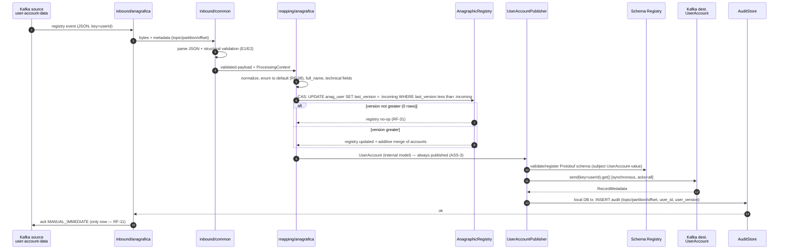
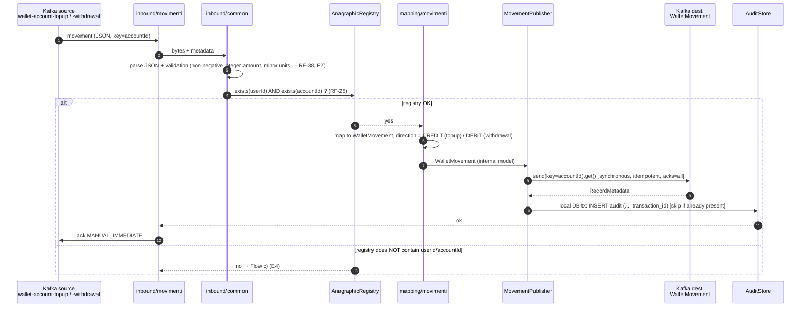
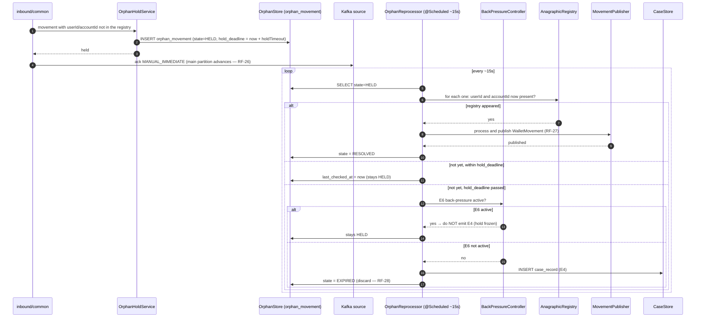
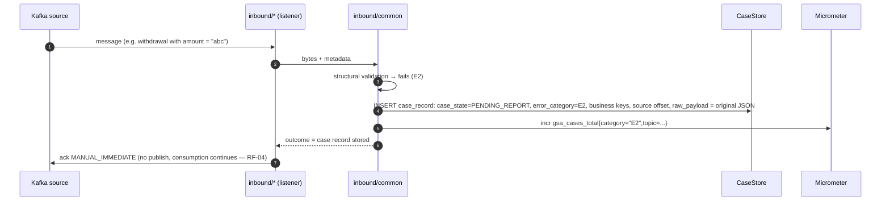
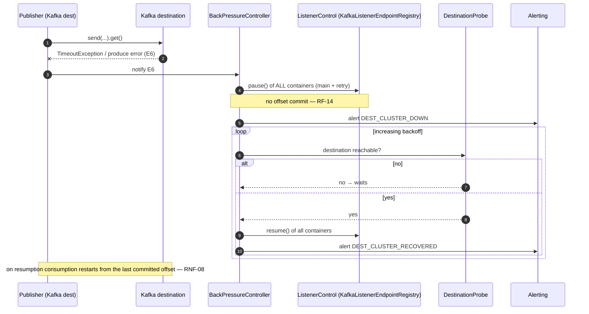
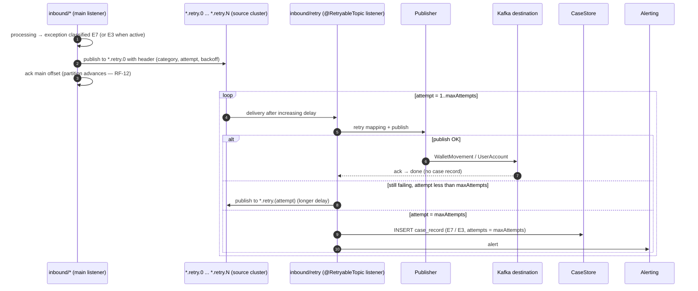
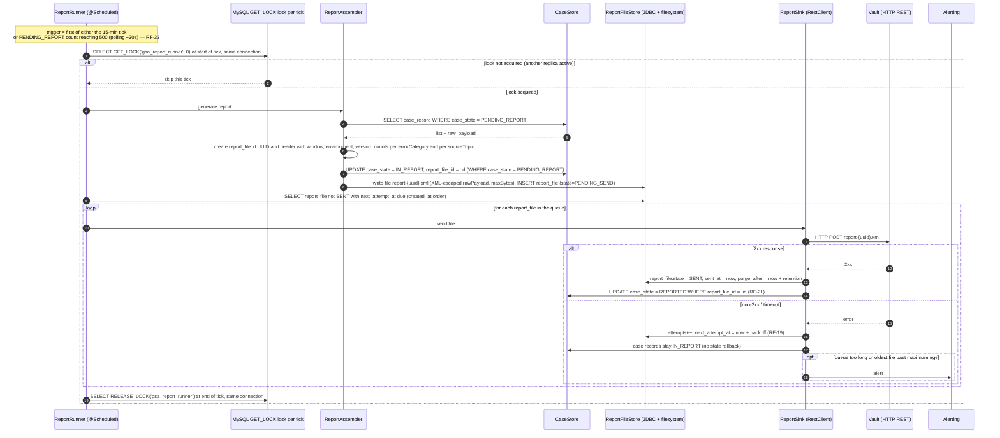

# Flows

`sequenceDiagram` of the main paths. Actors = components from
[`componenti.md`](componenti.md); the `RF-*` / `RNF-*` references point to the
[functional analysis](../analisi/ingestione-anagrafica-e-movimenti-wallet.md).
Each flow ends with the **verifiable criteria** for the testers.

## a) Registry — happy path

**Caption.** The `UserAccount` message is published for every event, even
out-of-sequence ones; only the local registry ignores events with a non-greater
`version`. The offset ack happens after a confirmed publish **and** the audit
write.

**Verifiable criteria.**

- Valid event `userId=U1 version=5` → one record on `UserAccount` with
  `user_id=U1 version=5 full_name` set, key `U1`; one `audit` row;
  `anag_user(U1).last_version=5`; offset committed only afterwards.
- Second event `userId=U1 version=3` → `UserAccount` published again;
  `anag_user(U1).last_version` stays 5.

## b) Movement (topup / withdrawal) — happy path

**Verifiable criteria.**

- `U1/A1` in the registry, topup `T1 amount=1000 currency=EUR` → one
  `WalletMovement` with `transaction_id=T1`, `amount{minor_units=1000,
  currency="EUR"}`, `direction=CREDIT`, key `A1`; one `audit` row with
  `transaction_id=T1`.
- Replay of the same topup `T1` on the same day → no second `audit` row, no
  second publish (`UNIQUE (txn_dedup, published_at)` on the generated column;
  dedup is at partition/day granularity — a replay several days apart may
  republish and is absorbed by the downstream, ADR 0009).

## c) Orphan movement — holding, scheduler, resolution or E4

**Caption.** The grace period is a deadline on `orphan_movement.hold_deadline`,
not an attempt count. During E6 back-pressure the deadline is **frozen**: no `E4`
until consumption towards the destination is possible again (ADR 0003).

**Verifiable criteria.**

- topup with `A1` absent → not published immediately; one `orphan_movement` row
  `state=HELD`; the source-topic offset is committed; the partition continues.
- Registry for `A1` within `holdTimeout` → on the next scheduler pass one
  `WalletMovement CREDIT`; `orphan_movement.state=RESOLVED`; no `case_record`.
- No registry within `holdTimeout`, destination reachable → `case_record` with
  `error_category=E4`; `orphan_movement.state=EXPIRED`.
- Expiry while E6 is active → no E4 `case_record` until E6 clears.

## d) E2 error (structural invalidity) — immediate case record

**Verifiable criteria.**

- `withdrawal amount="abc"` → nothing on the destination cluster; one
  `case_record` `error_category=E2` with `business keys` and `source_offset` set
  and `raw_payload` = original JSON; the next message is consumed.
- `E1` (unparsable JSON) → same behaviour with `error_category=E1`.

## e) E6 — destination cluster unreachable → back-pressure

**Verifiable criteria.**

- With the destination down: the consumers are paused; no offset progress; a
  single `DEST_CLUSTER_DOWN` alert; no burst of `case_record`.
- On destination restart: consumption resumes from the last committed offset, no
  message lost, no duplicate beyond those absorbed by idempotence.

## f) Retry E3/E7 via `@RetryableTopic`

**Caption.** The per-category routing (number of levels, backoff profile) is
configured by a custom `RetryTopicConfiguration`; the category travels in a
header (ADR 0004). The order of messages that went through the retry topics is
not guaranteed (RF-30, absorbed by downstream idempotence).

**Verifiable criteria.**

- An `E7` that does not resolve within `maxAttempts` → one `case_record`
  `error_category=E7 attempts=maxAttempts`; the main partition never blocked.
- An `E7` that resolves on the 2nd attempt → the message is published once, no
  `case_record`.

## g) XML report generation and send

**Caption.** Only one runner active at a time (MySQL application lock `GET_LOCK`,
acquired and released **within the same tick** on the same connection: the MySQL
lock is per-connection). Case records move to `IN_REPORT` on file creation and to
`REPORTED` **only** after `2xx`; on failure they stay `IN_REPORT` and the **same**
`report_file` (same `id` = same file name) is retried, so the Vault receives no
duplicates (RF-20).

**Verifiable criteria.**

- 5 `PENDING_REPORT` case records + trigger → one XML file with 5 `<case>` and a
  `<header>` with window, environment, adapter version and counts per category
  and per topic; the 5 case records move to `IN_REPORT`.
- Vault responding non-2xx on the 1st attempt → case records stay `IN_REPORT`,
  `report_file.attempts` incremented, `next_attempt_at` in the future; after a
  `2xx` they move to `REPORTED`; a resend of the same `report-<uuid>.xml` does
  not create a duplicate on the Vault side.
- With two active replicas, only one runner generates/sends (the other skips the
  tick).
