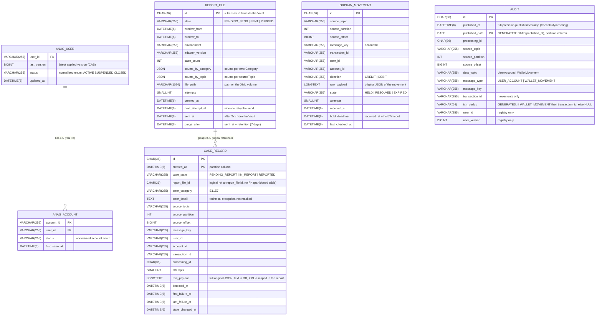
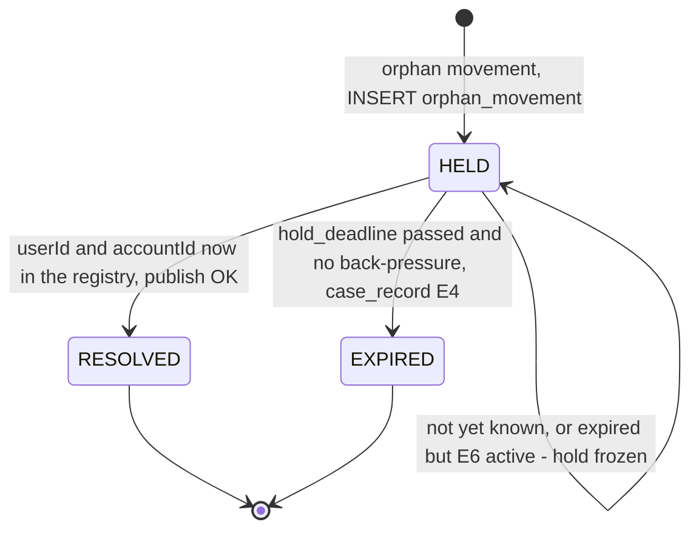
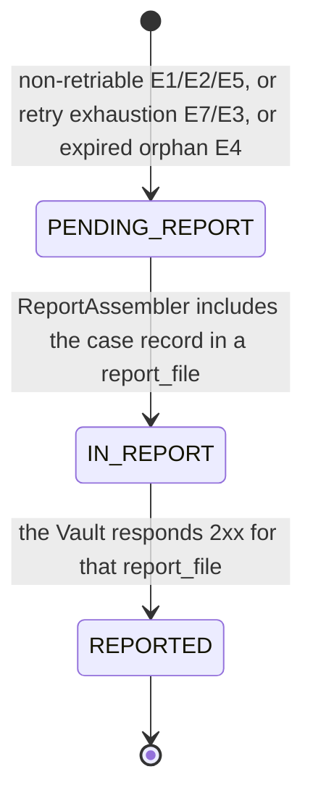
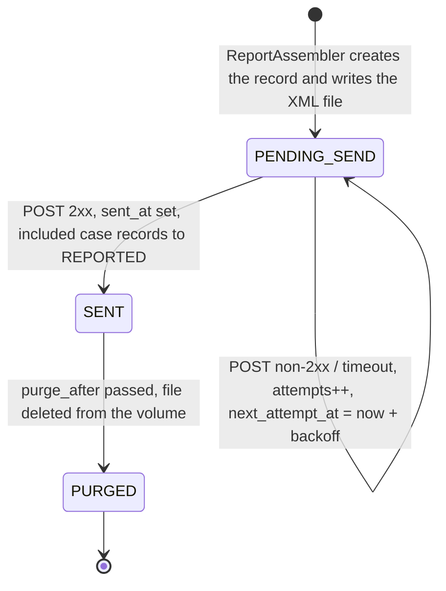

# Data model (MySQL 8.0)

A single database. Areas: **anagraphic registry** (`anag_user`, `anag_account`),
**orphan movements on hold** (`orphan_movement`), **case-record store**
(`case_record`), **report files** (`report_file`), **audit** (`audit`). Loss of
DB connectivity causes back-pressure, never data loss or a crash (RNF-12).

- Engine: **MySQL 8.0** (the user already has MySQL 8.0 + Workbench). Exact image
  / instance to be confirmed with `devops`.
- Access: **Spring Data JDBC** (ADR [0011](adr/0011-accesso-dati-spring-data-jdbc.md)),
  MySQL dialect auto-detected.
- Migrations: **Flyway** with the `flyway-mysql` module, versioned SQL in
  `db/migration` (ADR [0010](adr/0010-versioning-schema-flyway.md)). The DDL/DML
  scripts are written by `adapter-dev` during implementation, they are not part
  of this document.
- App readiness requires that the Flyway migrations are applied (ADR
  [0018](adr/0018-liveness-readiness-shutdown.md)).
- **Time**: the temporal columns are `DATETIME(6)` and the app always writes in
  **UTC**. `TIMESTAMP` is avoided (year-2038 limit and implicit time-zone
  conversions).

## Schema — erDiagram

**Caption.** `anag_user`↔`anag_account` is the only relation with a **real FK**
(1:N, ADR [0014](adr/0014-relazione-1n-accounts-inline.md)).
`report_file`↔`case_record` is an application-level **logical reference**
(`case_record` is partitioned and MySQL 8 does not allow FKs on partitioned
tables): a `PENDING_REPORT` case record has a null `report_file_id`.
`orphan_movement` and `audit` are independent tables. `audit` and `case_record`
have a **composite PK** that includes the partition column (see "MySQL 8.0
redesigns").

## MySQL 8.0 redesigns

Compared with the PostgreSQL hypothesis, the retarget onto MySQL 8.0 forces three
schema changes. These are the **only real redesigns**; everything else (CAS,
upsert, guarded updates, state machines) is identical.

1. **Movement deduplication — no partial unique index.** MySQL has no partial
   unique indexes with a predicate. Replacement: a **generated** column
   `txn_dedup VARCHAR(64) GENERATED ALWAYS AS (IF(message_type = 'WALLET_MOVEMENT',
   transaction_id, NULL)) STORED` + a **second generated** column
   `published_date DATE GENERATED ALWAYS AS (DATE(published_at)) STORED`
   (UTC calendar date truncated from `published_at`) + a
   `UNIQUE (txn_dedup, published_date)` constraint. Multiple `NULL`s are allowed
   in a MySQL `UNIQUE`, so the registry rows (`txn_dedup` = `NULL`) do not enter
   the constraint.
   *Consequence:* deduplication is at exact **calendar-day granularity**: a
   replay of the same `transaction_id` on the same day — at any exact
   `published_at` instant within that day — is blocked (skip-republish); a
   replay on a different day may republish, but the downstream stays idempotent
   on `transaction_id` (RF-30, ADR 0009) and, in any case, after 30 days the
   original row has been removed by retention.
   *Alternative:* a non-partitioned table `movement_dedup(transaction_id PK)`
   written in the **same local tx** as the audit (exact global dedup, one extra
   write). **The generated column is recommended**; `movement_dedup` if strict
   global dedup is required.
2. **Composite PK for partitioning.** In MySQL every `PRIMARY` / `UNIQUE` key of a
   partitioned table must include **all** the columns of the partition function.
   `audit` is partitioned directly on the generated `published_date` column
   (`PARTITION BY RANGE COLUMNS (published_date)`), which also happens to be the
   dedup-granularity column from point 1 above: `audit` PK `(id, published_date)`,
   `UNIQUE (txn_dedup, published_date)`, and `case_record` PK `(id, created_at)`
   (partitioned by `PARTITION BY RANGE (TO_DAYS(created_at))`, unchanged —
   `case_record` has no analogous dedup key). `published_at` remains a normal,
   full-precision, non-key column on `audit` for traceability/ordering.
3. **No FK on partitioned tables.** `case_record` is partitioned → the link
   `case_record.report_file_id → report_file.id` is a **logical reference**
   enforced by the application, not an FK constraint. `report_file` is not
   partitioned; `anag_account.user_id → anag_user.user_id` remains a real FK.

## Anagraphic registry

- **`anag_user`** — one record per `userId` whose registry the adapter has
  consumed. `last_version` is the latest **applied** `version`.
- **`anag_account`** — one record per seen `accountId`, linked to a `userId`
  (1:N, real FK). **Additive merge**: an account already present is **not
  removed** by a later event that does not list it; the account `status` is
  updated to the latest event that contains it (§4.4 of the analysis, ADR 0014).
- The registry upsert uses `INSERT ... ON DUPLICATE KEY UPDATE` (for the account:
  `INSERT IGNORE` when it is enough to record its existence).
- The orphan check (RF-25) is a PK read on `anag_account.account_id`.
- Persisted across restarts (RNF-13). No PII in clear here beyond the
  identifiers: name, tax code, email, phone are not persisted in the registry
  (they appear only in the outbound Protobuf message and, in clear, in the XML
  reports — ADR [0019](adr/0019-pii-in-chiaro-nei-report.md)).

### CAS on `last_version` (RF-31)

The registry update is a **compare-and-set in SQL**, **identical** in MySQL:
`UPDATE anag_user SET last_version = :incoming, status = :status,
updated_at = :now WHERE user_id = :userId AND last_version < :incoming`.
"0 rows updated" is the expected outcome of an out-of-sequence event: a no-op,
the `UserAccount` message is published anyway (ADR 0009). No explicit lock, no
exception to retry; safe with multiple replicas because the `userId` key pins the
inbound partition.

## Orphan movement holding area

- **`orphan_movement`** — one record per movement whose `userId` / `accountId` is
  not (yet) in the registry. It keeps the original payload and the source
  metadata for reconstruction and for the E4 case record.
- `hold_deadline = received_at + holdTimeout` (default 60 s, per environment).
- `OrphanReprocessor` (`@Scheduled`, ~15 s) selects the `state = 'HELD'` rows and
  for each one: if `userId` and `accountId` are now in the registry → process,
  publish, `state = 'RESOLVED'`; if `now() > hold_deadline` **and** E6
  back-pressure is **not** active → `case_record` (E4), `state = 'EXPIRED'`; if
  expired but under back-pressure → left `HELD` (hold **frozen**), retried on the
  next pass (ADR [0003](adr/0003-grace-period-orfani-scheduler.md)).

## Case-record store — state machine

- Transitions with **guarded updates** `... WHERE case_state = :expected`, no
  state-machine library (decision confirmed in Batch 5). Identical in MySQL.
- `PENDING_REPORT → IN_REPORT` happens when `ReportAssembler` selects the case
  records and creates the `report_file` (RF-32). From that point `report_file_id`
  is set (logical reference).
- `IN_REPORT → REPORTED` happens **only** after `2xx` from the Vault (RF-21). On
  a failed send the case record **stays `IN_REPORT`** (aligned with §5.3 of the
  analysis): it does not go back to `PENDING_REPORT`, it is the same
  `report_file` that is retried (same `id` → no duplicate on the Vault side,
  RF-19/RF-20).

## `report_file` lifecycle

- The **durable queue** for sending is the set of rows `state <> 'SENT'`.
  `ReportRunner` on each tick sends, in `created_at` order, those with
  `next_attempt_at <= now()` (ADR [0016](adr/0016-report-runner-in-process.md)).
- Alert when the queue exceeds a length threshold or when the oldest unsent row
  exceeds a maximum age (RF-23).
- `purge_after = sent_at + retention` (7 days, per environment, RF-36); a pruning
  job deletes the file from the volume and moves the state to `PURGED` (the
  record stays until the DB retention).

## Indexes

| Table | Index | Purpose |
|---|---|---|
| `anag_user` | PK `user_id` | upsert, CAS, user existence check |
| `anag_account` | PK `account_id`; FK + `idx_anag_account_user (user_id)` | orphan check O(1); trace a user's accounts |
| `orphan_movement` | PK `id`; `idx_orphan_due (state, hold_deadline)`; `idx_orphan_key (state, account_id)` | selection of rows to re-check; lookup by account |
| `case_record` | **PK `(id, created_at)`**; `idx_case_pending (case_state, created_at)`; `idx_case_file (report_file_id)` | partitioning; selection for the report; logical join with `report_file` |
| `report_file` | PK `id`; `idx_report_queue (state, next_attempt_at)`; `idx_report_purge (state, purge_after)` | send queue; pruning |
| `audit` | **PK `(id, published_date)`**; `idx_audit_origin (source_topic, source_partition, source_offset)` **non-unique** (RNF-11); **`UNIQUE (txn_dedup, published_date)`** | physical traceability; movement skip-republish at calendar-day granularity (ADR 0009) |

- MySQL has no **partial** unique indexes: the "movements only" selectivity is
  obtained with the generated column `txn_dedup` (`NULL` for the registry) — see
  "MySQL 8.0 redesigns" point 1.
- The state indexes (`state`, `case_state`) are composite with the column used in
  the `WHERE` because MySQL does not support an index predicate.
- The registry has **no** uniqueness constraint on `(user_id, user_version)` in
  `audit`: `UserAccount` is republished for every event, deduplication is
  downstream (ASS-3, ADR 0009).

## Partitioning and retention

| Table | Retention | Mechanism (MySQL 8.0) |
|---|---|---|
| `anag_user`, `anag_account` | permanent | it is the registry state (RNF-13) |
| `orphan_movement` | 7 days from `RESOLVED` / `EXPIRED` (per environment) | scheduled batch `DELETE`; low volume, no partitioning |
| `case_record` | **30 days** (per environment) | `PARTITION BY RANGE (TO_DAYS(created_at))`, daily partition, `ALTER TABLE case_record DROP PARTITION` for the expired partitions |
| `report_file` | **30 days** (per environment) | scheduled batch `DELETE`; low volume, no partitioning |
| `audit` | **30 days** (per environment) | `PARTITION BY RANGE COLUMNS (published_date)` (generated `DATE(published_at)` column), daily partition, `ALTER TABLE audit DROP PARTITION`. At 100 msg/s ≈ 8.6 M rows/day |
| XML files on the volume | **7 days** after `SENT` (per environment) | pruning → `report_file.state = 'PURGED'` (RF-36, RNF-18) |

- The **30-day** retention for `audit` and `case_record` is a **technical
  decision** confirmed (AD-retention-audit-window, Batch 12), not a business
  requirement: it exists to contain the growth of `audit` (≈ 8.6 M rows/day). The
  value is **configurable per environment**. The analysis notes it in §10.
- `case_record` is partitioned by `created_at`: a blind `DROP PARTITION` would
  also remove any **non-**`REPORTED` case records older than the window (e.g.
  Vault unreachable for weeks). **Confirmed decision (2026-09-04): mandatory
  pre-check before `DROP PARTITION`.** The `case_record` pruning job, before
  dropping a partition, verifies it contains no rows with `case_state <>
  'REPORTED'`; if it does, it **skips** the drop of that partition and emits an
  alert. Strict guarantee: no case record deleted before it is sent to the Vault.
  The implementation of the check is up to `adapter-dev`; `audit` does not have
  this constraint (no state to preserve) and uses a direct `DROP PARTITION`.

## Verifiable criteria (for the testers)

- Two registry events for the same `userId` with `version` 5 then 3: after the
  second, `anag_user.last_version` is still 5; two `UserAccount` messages have
  been published.
- A registry event that lists `A1` and then one that lists only `A2`: after the
  second, `anag_account` contains both `A1` and `A2` (additive merge).
- An orphan movement resolved within `holdTimeout`: `orphan_movement.state =
  'RESOLVED'`, no `case_record`, one `WalletMovement` message published.
- An orphan movement not resolved within `holdTimeout` with the destination
  reachable: `orphan_movement.state = 'EXPIRED'`, one `case_record` with
  `error_category = 'E4'`.
- An upstream replay of the same `transaction_id` **on the same day** (any
  `published_at` instant within that UTC calendar date) does not create a
  second row in `audit` (`UNIQUE (txn_dedup, published_date)` constraint) and
  is not republished.

> Updated 2026-09-04: MySQL 8.0 retarget from PostgreSQL (documents only; the SQL
> scripts are produced by `adapter-dev`).
