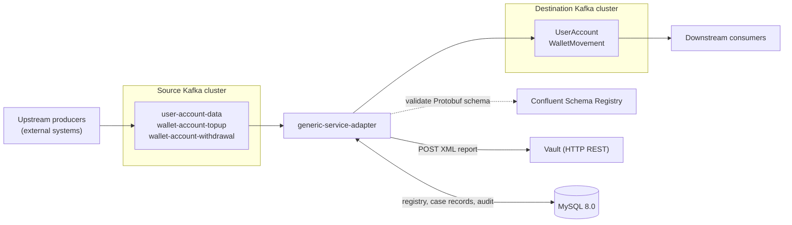
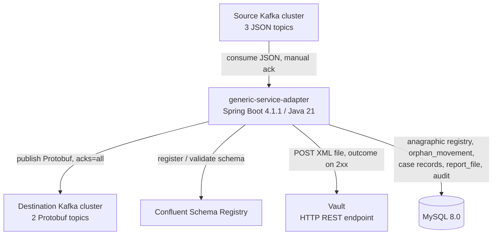
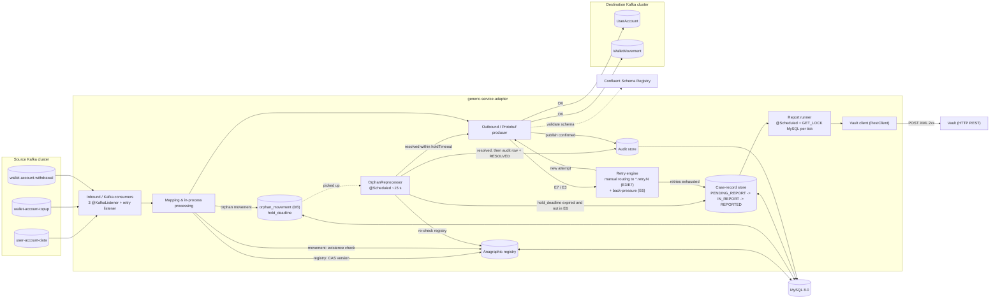
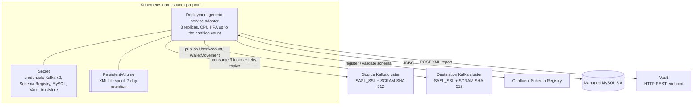

# Architecture overview

The **generic-service-adapter** is a single Spring Boot application (Boot 4.1.1,
Java 21, package `it.generic_service_adapter`) that consumes from the three JSON
topics of the **source** cluster, transforms to **Protobuf** and publishes to the
two topics of the **destination** cluster, handling retries, case records and XML
reports to the Vault.

The diagrams in this section are **inline Mermaid** in the Markdown files.
Documentation is delivered as PDF/Word generated with Pandoc (`make pdf` /
`make docx`); see ADR 0020.

## Panorama — the whole pipeline

Upstream producers → source cluster → adapter → destination cluster → downstream
consumers, with Schema Registry and Vault as side dependencies.

## C4 level 1 — System context

What the adapter talks to **directly**: the two Kafka clusters, the Schema
Registry, the Vault and MySQL 8.0. Upstream producers and downstream consumers
talk to the clusters, not to the adapter, and stay in the panorama above.

- **Inbound.** Upstream producers (unidentified external systems) publish to
  `user-account-data`, `wallet-account-topup`, `wallet-account-withdrawal`.
  Messages arrive already keyed (`userId` for the registry, `accountId` for
  movements) and may be **replayed** → the adapter is idempotent (RNF-04).
- **Outbound.** Two Protobuf topics on the destination cluster: `UserAccount`
  (key `userId`) and `WalletMovement` (key `accountId`, `direction` =
  `CREDIT`/`DEBIT` for unified topup and withdrawal). Schema registered/validated
  against the Confluent Schema Registry.
- **Report.** The XML case-record reports go to the **Vault** via `HTTP POST`;
  the send is considered successful only on a `2xx` response.

## C4 level 2 — Containers

The adapter's internal modules and the external dependencies, grouped by
responsibility along a message's path:

## Container responsibilities

| Container | Technology | Responsibility | Requirements |
|---|---|---|---|
| Inbound / Kafka consumers | Spring Kafka | 3 `@KafkaListener` (registry, topup, withdrawal) + retry-topic listener. JSON deserialization, structural validation, `MANUAL_IMMEDIATE` ack only after the outcome. | RF-01…04, RF-11 |
| Mapping & in-process processing | Java 21 | String normalization, enum→enum with explicit default, ISO-8601 → `Timestamp` parsing, amounts in minor units, derived and technical fields (`ingestion_time`, `source`, `processing_id`). **No** external calls. | RF-05…08, RF-38 |
| Anagraphic registry | Spring Data JDBC | Seen users/accounts + latest `version` per `userId` (1:N relation, additive merge of accounts). Existence check for movements; SQL CAS on out-of-sequence updates. | RF-24, RF-25, RF-31 |
| Orphan-movement handling | `orphan_movement` table + `@Scheduled` | `OrphanHoldService` parks the movement with `hold_deadline` (default `holdTimeout` 60 s). `OrphanReprocessor` every ~15 s: resolved → dedup check, publish, `audit` row + `RESOLVED` in one post-publish tx; expired and not under back-pressure → E4 case record + `EXPIRED`; expired under E6 → hold frozen. No retry topic. | RF-26…28 |
| Retry engine | Spring Kafka (manual retry routing, ADR 0002) | The adapter publishes failed records to `*.retry.<n>` on the source cluster with category/attempt/backoff headers; the `inbound/retry` backoff listener applies a non-blocking delay and re-attempts, writing a `case_record` on exhaustion. `BackPressureController` for E6 (listener pause). `maxAttempts`, backoff configurable (`gsa.retry.*`). | RF-12, RF-14, RF-15 |
| Outbound / Protobuf producer | Spring Kafka + `KafkaProtobufSerializer` | Protobuf serialization, schema registration/validation, synchronous `send()` to `UserAccount` and `WalletMovement` preserving the business key; `enable.idempotence=true`, `acks=all`. | RF-06, RF-09, RF-10, RF-37 |
| Case-record store | Spring Data JDBC | State machine `PENDING_REPORT` → `IN_REPORT` → `REPORTED` with guarded updates. One record per non-retriable message (E1/E2/E5) or per retry exhaustion (E7/E3/E4). | RF-13, RF-16, RF-32 |
| Audit store | Spring Data JDBC | One record per successfully published message, with origin `topic/partition/offset`, business keys and `processing_id`, written **before** the offset commit. `UNIQUE (txn_dedup, published_date)` on the generated columns `txn_dedup` + `published_date` (`DATE(published_at)`) for movement skip-republish; `published_at` stays as a full-precision non-key column. | RF-29, RNF-14 |
| Report runner | Java 21 + `@Scheduled` + MySQL application lock (`GET_LOCK` per tick) | Single-instance across replicas. Produces the XML file from `PENDING_REPORT` case records on the first of either the schedule (15 min) or the threshold (500); XML marshalling per the versioned XSD. | RF-17, RF-33, RF-34 |
| Vault client | Spring `RestClient` | `POST` of the XML file, outcome only on `2xx`, retry with backoff on the `report_file` queue, transfer id = `report_file.id` (UUID) deterministic. Marks `REPORTED` only after `2xx`. | RF-18…21, RF-36 |
| XML file spool | Filesystem / PVC | Pending and already-sent XML files on a persistent volume. 7-day retention, configurable. | RF-36, RNF-18 |
| Observability | Actuator + Micrometer + Prometheus | Health `liveness` / `readiness` (readiness = DB + source Kafka + Flyway) and `gsa_*` metrics on `/actuator/prometheus`. | RNF-07, RF-22 |
| Database | **MySQL 8.0** (exact image / instance to be confirmed with `devops`) | Anagraphic registry, `orphan_movement`, case records, `report_file`, audit. `RANGE (TO_DAYS(...))` partitioning for `audit` / `case_record`, generated columns for dedup, `GET_LOCK` for the report runner. State persisted across restarts. | RNF-12, RNF-13 |

## C4 level 3 — Deployment (prod)

Deployment on Kubernetes. In `dev` the same elements apply with 2 replicas, no
HPA, `PLAINTEXT` towards the Kafka clusters and auxiliary services in
docker-compose. Resource figures and thresholds are in [nfr.md](nfr.md); the
manifests are owned by `devops`.

## Technology stack

| Area | Choice | Note |
|---|---|---|
| Runtime | Java 21, Spring Boot 4.1.1, Maven (`./mvnw`) | base package `it.generic_service_adapter` |
| Messaging | Spring Kafka; manual retry routing to source-cluster `*.retry.<n>` for E3/E7 (ADR 0002); **no DLT** (ADR 0005) | two distinct clusters (source, destination); retry topics on the source (ADR 0006) |
| Outbound serialization | Protobuf + `KafkaProtobufSerializer` + Confluent Schema Registry (`TopicNameStrategy`, `BACKWARD` compat) | `.proto` contract owned by this repo (ADR 0012, 0013, 0015) |
| Persistence | **MySQL 8.0** via **Spring Data JDBC**; **Flyway** migrations (`flyway-mysql`) | registry, orphans, case records, `report_file`, audit (ADR 0010, 0011) |
| Report | XML marshalling per the versioned XSD; `RestClient` towards the Vault | single-instance in-process runner (ADR 0016) |
| Observability | Spring Boot Actuator + Micrometer + `micrometer-registry-prometheus` (new dependencies) | health and `gsa_*` metrics (ADR 0017) |
| Deploy | Docker; Kubernetes + Kustomize (`dev`, `prod` overlays) | detail owned by `devops` |

> **Section boundaries.** This page describes *what* each container does and
> *how* it fits together. The detailed internal decomposition (layers,
> sub-packages, ports, ownership) is in [`componenti.md`](componenti.md);
> non-obvious choices are in the [ADRs 0001-0020](adr/index.md); deployment
> details (image, manifests, HPA, resources) are owned by `devops` starting from
> the constraints in [`nfr.md`](nfr.md).
