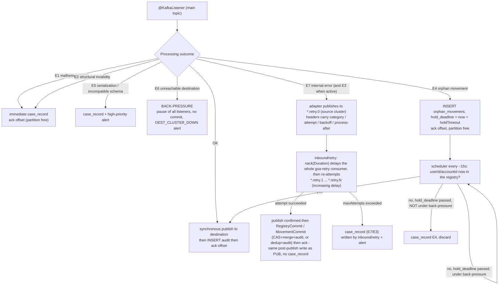

# Kafka topology

Two **distinct** clusters. The adapter consumes from the **source** and produces
to the **destination**. The retry topics live on the **source** cluster (ADR
[0006](adr/0006-retry-topic-cluster-sorgente.md)): same consumption domain, same
consumer/producer factory. **No DLT** (ADR [0005](adr/0005-assenza-dlt.md)): the
final destination of errors is the case-record store on MySQL 8.0.

## Topics

### Source cluster (inbound, JSON)

| Topic | Key | Content |
|---|---|---|
| `user-account-data` | `userId` | Registry events: `CREATED` / `UPDATED` / `CLOSED` with increasing integer `version` |
| `wallet-account-topup` | `accountId` | Top-ups / credits |
| `wallet-account-withdrawal` | `accountId` | Withdrawals / debits |
| `user-account-data.retry.<n>` | `userId` | Registry retry topic for E7 (`n` = 0..N-1) |
| `wallet-account-topup.retry.<n>` | `accountId` | Topup retry topic for E7 (and E3 when active) |
| `wallet-account-withdrawal.retry.<n>` | `accountId` | Withdrawal retry topic for E7 (and E3 when active) |

A **set of retry topics per source topic** (ADR
[0004](adr/0004-topologia-retry-topic.md)), with `N` levels of increasing delay.
The per-category backoff profile is carried by a header on the routed message.
There is **no** `.orphan-hold` topic: orphan movements (E4) are held in a MySQL
8.0 table, not on Kafka (ADR
[0003](adr/0003-grace-period-orfani-scheduler.md)).

### Destination cluster (outbound, Protobuf)

| Topic | Key | Content |
|---|---|---|
| `UserAccount` | `userId` | Transformed registry (Protobuf `UserAccount` message) |
| `WalletMovement` | `accountId` | Unified topup + withdrawal movements, `direction` = `CREDIT` / `DEBIT` |

Topup and withdrawal **converge** into `WalletMovement` with key `accountId`:
Kafka guarantees ordering per partition, so the movements of the same account
stay in the order the adapter publishes them, without downstream reconciliation
(RF-30). Exception: messages that went through a retry topic or were resolved by
the orphan scheduler may be published **out of order**; the downstream stays
idempotent on `transaction_id` (ADR [0009](adr/0009-deduplica-idempotenza.md)).

## Partitions per environment

| Topic class | dev | prod |
|---|---|---|
| Source (`user-account-data`, `wallet-account-topup`, `wallet-account-withdrawal`) | 3 | 6 |
| Retry topics (`*.retry.<n>`) | 3 | 6 |
| Destination (`UserAccount`, `WalletMovement`) | 3 | 6 |

**Uniform** sizing 3 / 6 (ADR 0004). The retry topics replicate the partitioning
of the main topics to preserve the key and the recovery parallelism during a
mass E7 incident. Number of levels `N` and retention of the retry topics:
per-environment parameters, to be agreed with `devops` (proposal: short
retention, greater than `holdTimeout` and than the maximum E7 retry duration).

## Consumption

| Aspect | Choice | Note |
|---|---|---|
| Application | **single**, 3 main `@KafkaListener` + retry-topic listener + scheduler | DA-consumer-model, ADR [0001](adr/0001-strati-e-confini-componenti.md) |
| Consumer group | **one per role**: `gsa-anagrafica`, `gsa-movimenti`, `gsa-retry` (AD-consumer-group-naming, confirmed) | independent pause and scaling per role: useful for back-pressure and for scaling the movements (50% + 30% of the load) without touching the registry |
| Per-listener `concurrency` | **= partition count** of the topic (3 dev / 6 prod) | ADR [0018](adr/0018-liveness-readiness-shutdown.md) defers to NFR; horizontal scaling up to the partitions (RNF-15) |
| Ack mode | **`MANUAL_IMMEDIATE`** | ack only after confirmed publish, recorded case record or routing to a retry topic (RF-11, ADR [0008](adr/0008-ack-manuale-confine-commit.md)) |
| `max.poll.records` | per-environment parameter | tuned so as not to exceed the synchronous publish time of the batch |
| Deserialization | `ByteArrayDeserializer` + JSON parsing in `inbound/common` | a malformed JSON is E1, not an unhandled deserialization exception |

## Production (destination cluster)

| Property | Value | Requirement |
|---|---|---|
| `enable.idempotence` | `true` | RNF-04, ADR 0009 |
| `acks` | `all` | RNF-03 |
| `max.in.flight.requests.per.connection` | `<= 5` | per-partition ordering with idempotence |
| `retries` | high (idempotent default) | absorbs network blips, not E6 |
| `max.block.ms` / `request.timeout.ms` / `delivery.timeout.ms` | per-environment (dev/e2e `10s/10s/30s`, prod `15s/15s/120s`), `delivery.timeout.ms >= linger.ms + request.timeout.ms` | bound `send()` against an unreachable destination so it fails fast into `E6` instead of blocking the listener thread indefinitely (ADR 0007, `gsa.kafka.destination.*`) |
| Send | synchronous `send().get(publishTimeout)` before the offset ack — `publishTimeout` is a publisher-side backstop strictly above `delivery.timeout.ms` | RF-11, ADR 0008, ADR 0007 |
| Serialization | `KafkaProtobufSerializer` + Schema Registry, `TopicNameStrategy`, `BACKWARD` compat | RF-37, ADR [0015](adr/0015-schema-registry-subject-compat.md) |
| Key | `userId` (`UserAccount`) / `accountId` (`WalletMovement`) | RF-10 |

## Error-category → outcome mapping

| Cat. | Error | Retriable | Mechanism | Ordering |
|---|---|---|---|---|
| **E1** | Malformed / unparsable JSON | No | immediate `case_record`, offset committed | n/a |
| **E2** | Structural invalidity (mandatory field, non-integer/negative amount, unparsable timestamp) | No | immediate `case_record`, **not** published, consumption continues | n/a |
| **E3** | External dependency unavailable | Yes | **Provisioned, not active** (no external calls). When active: the adapter publishes to `*.retry.0` (source cluster) with category/attempt/backoff headers; `inbound/retry` applies a non-blocking delay and re-attempts up to `maxAttempts`; exhaustion → `case_record` | not guaranteed for those messages |
| **E4** | Orphan movement (user/account not in the registry) | Yes (time-bounded) | `orphan_movement` in MySQL 8.0 + `OrphanReprocessor` every ~15s; resolved → publish, `hold_deadline` passed → `case_record`. **Hold frozen during E6** | not guaranteed for those messages |
| **E5** | Protobuf serialization failed / incompatible schema | No | `case_record` + high-priority alert (systemic problem) | n/a |
| **E6** | Destination cluster unreachable / produce failed | Yes | **Back-pressure**: `pause()` of all listeners, no commit, `DestinationProbe`, alert. No mass case records | preserved (partition halted) |
| **E7** | Unexpected internal error (NPE, bug) | Yes (limited) | The adapter publishes to `*.retry.0` (source cluster) with category/attempt/backoff headers; `inbound/retry` applies a non-blocking delay and re-attempts up to `maxAttempts`; exhaustion → `case_record` + alert | not guaranteed for those messages |

**Why E6 does not use the retry topics.** If the destination is down, every
message would fail: routing them all would produce a storm of case records and
lose the per-account ordering. Pausing the listeners lets the lag grow in a
controlled way and resumes from the last committed offset when the cluster comes
back (RF-14, RNF-08).

**Why E4 does not use the retry topics.** The grace period is a **time
deadline** (`holdTimeout`, default 60 s), not an attempt count. A table with
`hold_deadline` and a scheduler give a precise deadline, are queryable for
observability and make it possible to **freeze** the deadline while E6
back-pressure is active (the scheduler checks the back-pressure state before
emitting E4). A deviation from the architect's initial recommendation, confirmed
by the stakeholder (ADR 0003).

## Back-pressure — scope

`E6` suspends **all** consumer groups (main and retry), not just the one that hit
the error: the destination cluster is unique, a selective pause would not give
useful throughput and would complicate the state (ADR 0007). Resumption is
governed by `DestinationProbe` with backoff.

## Delivery and commit

- Delivery semantics towards the recipient: **at-least-once** (RNF-03). No
  inbound message is discarded without being published, recorded as a case
  record or routed (retry topic or `orphan_movement`).
- Step order for an OK message: **synchronous publish → local DB tx (audit + any
  registry update) → ack offset**. No Kafka transaction across the two clusters
  (ADR 0008).
- Duplicates from a crash between publish and ack are absorbed by downstream
  idempotence and by movement skip-republish (`audit` with a `UNIQUE` constraint
  on the generated column `txn_dedup`, ADR 0009).

## Transport security

| Environment | Protocol | Auth | Credentials |
|---|---|---|---|
| `dev` | `PLAINTEXT` | none | docker-compose |
| `prod` | `SASL_SSL` | `SCRAM-SHA-512` | external secrets, non-versioned truststore (RNF-05, RNF-16) |

## Per-environment configurable parameters

`maxAttempts`, `backoffIniziale`, `backoffMax`, number of retry levels `N`,
`holdTimeout` (default 60 s), `OrphanReprocessor` interval (default 15 s), report
schedule (15 min), case-record threshold (500), report polling count (default
30 s), XML file retention (7 days), retry-topic retention, alert thresholds,
bootstrap servers of the two clusters, Schema Registry and Vault endpoints.
**No hardcoded value** (RF-15, RNF-09).

## Verifiable criteria (for the testers)

- An OK message produces exactly one record on `UserAccount` or `WalletMovement`,
  one `audit` row with the correct `source_topic/partition/offset`, and the
  offset is committed **only after** both.
- An `E2` produces nothing on the destination cluster, produces a `case_record`
  with `error_category = E2` and `raw_payload` present, and consumption of the
  next message continues.
- With the destination cluster down, the consumers are paused, there is no offset
  progress, `DEST_CLUSTER_DOWN` is emitted; when the cluster restarts,
  consumption resumes from the last committed offset with no loss.
- An `E7` goes through `*.retry.0..N` with increasing delay and, if it does not
  resolve, produces a `case_record` with `attempts = maxAttempts`.
- A topup followed by a withdrawal on the same `accountId`, consumed in that
  order, land in the same `WalletMovement` partition in the order topup →
  withdrawal.
